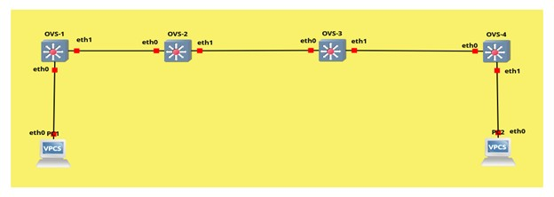

-----

# GNS3 ACL Manager - Complete Network Control System

[](https://opensource.org/licenses/MIT)
[](https://www.python.org/downloads/)
[](https://gns3.com/)

A powerful Python-based application for remotely managing Access Control Lists (ACLs) in GNS3 Open vSwitch topologies via SSH. Control your entire network infrastructure from your Ubuntu host machine without logging into individual devices.

-----

## 📋 Table of Contents

  - [Overview](https://www.google.com/search?q=%23overview)
  - [Features](https://www.google.com/search?q=%23features)
  - [Project Structure](https://www.google.com/search?q=%23project-structure)
  - [Prerequisites](https://www.google.com/search?q=%23prerequisites)
  - [Installation Guide](https://www.google.com/search?q=%23installation-guide)
  - [Quick Start](https://www.google.com/search?q=%23quick-start)
  - [Usage Examples](https://www.google.com/search?q=%23usage-examples)
  - [Documentation](https://www.google.com/search?q=%23documentation)
  - [Troubleshooting](https://www.google.com/search?q=%23troubleshooting)
  - [Contributing](https://www.google.com/search?q=%23contributing)
  - [License](https://www.google.com/search?q=%23license)
  - [Authors](https://www.google.com/search?q=%23authors)

-----

## 🎯 Overview

This project provides a comprehensive solution for network administrators and students to:

  - Set up a complete GNS3 virtual network environment on Ubuntu
  - Deploy Open vSwitch (OVS) appliances and Cisco routers
  - Remotely manage network ACL rules via SSH
  - Control traffic flow, ICMP, forwarding, and security policies
  - Perform batch operations across multiple network devices


-----
   ### Network Topoogy
   

## ✨ Features

### 🔧 ACL Management

  - **Blackhole Routes** - Block specific IPs/networks
  - **ICMP Control** - Enable/disable ping responses
  - **Interface Forwarding** - Control packet forwarding per interface
  - **Reverse Path Filtering** - Anti-spoofing protection
  - **Rate Limiting** - Prevent DoS attacks

### 🚀 Advanced Capabilities

  - **SSH-Based Control** - Manage devices remotely from host machine
  - **Multi-Device Support** - Control 4 OVS devices simultaneously
  - **Quick Templates** - Pre-configured ACL scenarios
  - **Batch Operations** - Apply rules to all devices at once
  - **Real-time Status** - View current ACL configurations
  - **Connectivity Testing** - Built-in ping and trace tools

### 💻 User Experience

  - **Color-coded Terminal UI** - Easy-to-read output
  - **Interactive Menus** - Simple navigation
  - **Configuration Persistence** - Save/load device settings
  - **Error Handling** - Clear error messages and recovery

-----

## 📁 Project Structure

```
GNS3-Project-Guideline/
│
├── code_for_acl_controlling_from_host_machine.py
│   └── Main Python application for ACL management
│
├── Documentation.docx
│   └── Complete setup guide (Ubuntu, GNS3, VMware, Appliances)
│
├── Guidelinesfile
│   └── Detailed usage instructions and troubleshooting
│
├── LICENSE
│   └── MIT License
│
└── README.md
    └── This file
```

-----

## 🔧 Prerequisites

### Hardware Requirements

  - **RAM:** 8GB minimum (16GB recommended)
  - **Storage:** 50GB free space
  - **CPU:** Intel VT-x/AMD-V support (virtualization enabled)
  - **Network:** Ethernet/WiFi connectivity

### Software Requirements

#### Host Machine

  - **OS:** Ubuntu 20.04 LTS or later (64-bit)
  - **Python:** 3.6 or higher
  - **SSH Client:** OpenSSH

#### GNS3 Environment

  - **GNS3 GUI:** Version 2.2.54
  - **GNS3 VM:** Version 2.2.54
  - **VMware Workstation Pro:** 25H2 or later
  - **Appliances:** Open vSwitch, Cisco IOS (optional)

#### Python Libraries

```bash
paramiko>=2.7.0  # SSH automation
```

-----

## 🚀 Installation Guide

### Step 1: Ubuntu Host Setup

1.  **Install Ubuntu Linux**

      - Download from [Ubuntu Official](https://ubuntu.com/download/desktop)
      - Create bootable USB (16GB)
      - Boot and install (follow documentation)

2.  **Update System**

    ```bash
    sudo apt update && sudo apt upgrade -y
    ```

### Step 2: Install GNS3

```bash
# Add GNS3 PPA repository
sudo add-apt-repository ppa:gns3/ppa

# Update package list
sudo apt update

# Install GNS3 GUI and Server
sudo apt install gns3-gui gns3-server -y
```

**Configuration Prompts:**

  - Allow non-superusers to run GNS3: **Yes** ✓
  - Allow non-superusers to capture packets: **Yes** ✓

### Step 3: Install VMware Workstation Pro

```bash
# Download VMware Workstation Pro
# Visit: https://www.vmware.com/products/desktop-hypervisor

# Make installer executable
chmod +x VMwarePro.bundle

# Run installer
sudo ./VMwarePro.bundle
```

**Enable Virtualization:**

  - Restart → Enter BIOS (F1/F2/DEL)
  - Enable VT-x/AMD-V
  - Save and exit

### Step 4: Setup GNS3 VM

1.  **Download GNS3 VM**

      - Visit: [https://gns3.com/software/download-vm](https://gns3.com/software/download-vm)
      - Select VMware Workstation version

2.  **Import VM**

    ```
    VMware → File → Open → Select GNS3 VM
    ```

3.  **Start GNS3 VM**

      - Power on the virtual machine
      - Note the IP address displayed

4.  **Connect GNS3 GUI to VM**

      - Launch GNS3 GUI
      - Select "Run appliances in a virtual machine"
      - Follow setup wizard

### Step 5: Install Open vSwitch Appliance

1.  Open GNS3 GUI
2.  Click **Browse Switches** (left panel)
3.  Click **New Template**
4.  Select **"Install an appliance from the GNS3 server"**
5.  Navigate: **Switches → Open vSwitch**
6.  Choose **"Install on GNS3 VM"**
7.  Click **Finish**

### Step 6: Install Alpine Linux Appliance

Alpine Linux is a CLI-based, lightweight operating system used as an end device.

1.  **Download Image**: Download the `alpine-linux.gns3a` file from the GitHub repository
2.  **Import Appliance**: Open GNS3, go to **File** → **Import appliance** and select the downloaded file
3.  **Server Type**: Select **"Install the appliance on the GNS3 VM (recommended)"** and click Next
4.  **Finish**: Follow the prompts to finish; the template will be available in the guest category
5.  **Configuration**: Unlike standard VPCS, configure Alpine Linux using the following commands
    ```bash
    # Assign IP Address
    ip addr add 10.0.1.2/24 dev eth0

    # Set Default Gateway
    ip route add default via 10.0.1.1 dev eth0
    ```
    ### Topology
    

### Step 7: Install Python Application

```bash
# Create project directory
mkdir -p ~/gns3-acl-manager
cd ~/gns3-acl-manager

# Install paramiko library
sudo apt-get install python3-paramiko -y

# Download the Python script
wget https://raw.githubusercontent.com/Raimal-Raja/GNS3-Project-Guideline/main/code_for_acl_controlling_from_host_machine.py

# Make executable
chmod +x code_for_acl_controlling_from_host_machine.py
```

-----

## ⚡ Quick Start

### 1\. Configure SSH on OVS Devices

Open console for each OVS device in GNS3 and run:

```bash
# Install SSH server
apk update
apk add openssh

# Generate SSH keys
ssh-keygen -A

# Set root password
passwd
# Enter: gns3acl (or your choice)

# Configure SSH
cat > /etc/ssh/sshd_config << 'EOF'
Port 22
PermitRootLogin yes
PasswordAuthentication yes
EOF

# Start SSH service
rc-service sshd start
rc-update add sshd default
```

### 2\. Configure Static Routing

On each OVS device:

```bash
# OVS1
ip addr add 10.0.1.1/24 dev eth0
ip addr add 10.0.2.1/24 dev eth1
ip route add 10.0.3.0/24 via 10.0.2.2
ip route add 10.0.4.0/24 via 10.0.2.2
ip route add 10.0.5.0/24 via 10.0.2.2

# OVS2
ip addr add 10.0.2.2/24 dev eth0
ip addr add 10.0.3.1/24 dev eth1
ip route add 10.0.1.0/24 via 10.0.2.1
ip route add 10.0.4.0/24 via 10.0.3.2
ip route add 10.0.5.0/24 via 10.0.3.2

# OVS3
ip addr add 10.0.3.2/24 dev eth0
ip addr add 10.0.4.1/24 dev eth1
ip route add 10.0.1.0/24 via 10.0.3.1
ip route add 10.0.2.0/24 via 10.0.3.1
ip route add 10.0.5.0/24 via 10.0.4.2

# OVS4
ip addr add 10.0.4.2/24 dev eth0
ip addr add 10.0.5.1/24 dev eth1
ip route add 10.0.1.0/24 via 10.0.4.1
ip route add 10.0.2.0/24 via 10.0.4.1
ip route add 10.0.3.0/24 via 10.0.4.1
```

### 3\. Test SSH Connectivity

```bash
# Test each device (ports 5000-5003)
ssh -p 5000 root@192.168.122.1  # OVS1
ssh -p 5001 root@192.168.122.1  # OVS2
ssh -p 5002 root@192.168.122.1  # OVS3
ssh -p 5003 root@192.168.122.1  # OVS4
```

### 4\. Run ACL Manager

```bash
cd ~/gns3-acl-manager
python3 code_for_acl_controlling_from_host_machine.py
```

**First-time Setup:**

  - Enter SSH username: `root`
  - Enter SSH password: `gns3acl` (your password)
  - Enter GNS3 VM IP: `192.168.122.1` (or your VM IP)
  - Enter base SSH port: `5000`

-----

## 💡 Usage Examples

### Example 1: Block VPC1 from Reaching VPC2

```
Main Menu → [1] Select Device → Choose OVS1
Main Menu → [2] Add ACL Rule → [1] Blackhole Route

Configuration:
- Source IP: 10.0.1.2
- Destination IP: 10.0.5.2/32
- Table: 100
- Priority: 100
```

**Test from VPC1:**

```bash
ping 10.0.5.2 -c 4
# Result: Destination unreachable
```

### Example 2: Disable ICMP on All Devices

```
Main Menu → [8] Batch Operations → [2] Disable ICMP on all devices
```

**Test from any VPC:**

```bash
ping 10.0.2.1 -c 4
# Result: All OVS devices won't respond to pings
```

### Example 3: Use Quick Template

```
Main Menu → [1] Select Device → Choose OVS1
Main Menu → [7] ACL Templates → [1] Block VPC1 → VPC2
```

Automatically applies blackhole route and routing rules.

### Example 4: View Current ACL Rules

```
Main Menu → [1] Select Device → Choose OVS3
Main Menu → [4] View ACL Rules (Current Device)
```

Shows:

  - IP routing rules
  - Custom routing tables
  - ICMP status
  - IP forwarding status
  - Reverse path filter status

### Example 5: Enable Security Features

```
Main Menu → [1] Select Device → Choose OVS2
Main Menu → [7] ACL Templates → [4] Enable full security

Applies:
- RP filter (anti-spoofing)
- ICMP rate limiting (10 packets/sec)
- TCP SYN backlog (128)
```

-----

## 📚 Documentation

### Complete Guides

  - **[Documentation.docx](https://www.google.com/search?q=./Documentation.docx)** - Full setup guide covering:

      - Ubuntu installation on hardware
      - GNS3 and GNS3 VM installation
      - VMware Workstation Pro setup
      - Appliance installation (OVS, Cisco)

  - **[Guidelinesfile](https://www.google.com/search?q=./Guidelinesfile)** - Detailed usage guide including:

      - Prerequisites and installation
      - Network configuration
      - SSH setup on GNS3 devices
      - Usage examples
      - Troubleshooting guide
      - Security best practices

### Quick Reference

#### Common ACL Operations

| Operation | Command Path |
|-----------|-------------|
| Add blackhole route | Menu → [2] → [1] |
| Disable ICMP | Menu → [2] → [2] |
| Enable forwarding | Menu → [2] → [3] |
| Enable RP filter | Menu → [2] → [4] |
| Set rate limit | Menu → [2] → [5] |
| View ACL rules | Menu → [4] |
| Batch operations | Menu → [8] |

#### Network Topology

```
Device  | eth0 IP    | eth1 IP    | SSH Port
--------|------------|------------|----------
OVS1    | 10.0.1.1   | 10.0.2.1   | 5000
OVS2    | 10.0.2.2   | 10.0.3.1   | 5001
OVS3    | 10.0.3.2   | 10.0.4.1   | 5002
OVS4    | 10.0.4.2   | 10.0.5.1   | 5003
VPC1    | 10.0.1.2   | -          | -
VPC2    | 10.0.5.2   | -          | -
```

-----

## 🔍 Troubleshooting

### Issue: Cannot Connect to Devices

**Symptoms:**

  - `Connection refused` errors
  - Timeout when connecting
  - `Device not reachable` messages

**Solutions:**

1.  **Verify GNS3 devices are running**

    ```bash
    # In GNS3: Check for green play icon on all devices
    ```

2.  **Test SSH manually**

    ```bash
    ssh -v -p 5000 root@192.168.122.1
    ```

3.  **Check SSH service on device**

    ```bash
    # From device console:
    rc-service sshd status
    netstat -tlnp | grep :22
    ```

4.  **Restart SSH service**

    ```bash
    rc-service sshd restart
    ```

5.  **Verify port forwarding**

    ```bash
    # Check GNS3 VM network settings
    virsh dumpxml GNS3VM | grep hostfwd
    ```

### Issue: ACL Rules Not Working

**Solutions:**

1.  **Verify rules are applied**

    ```bash
    ssh -p 5000 root@192.168.122.1 "ip rule show"
    ```

2.  **Check routing tables**

    ```bash
    ssh -p 5000 root@192.168.122.1 "ip route show table 100"
    ```

3.  **Verify IP forwarding**

    ```bash
    ssh -p 5000 root@192.168.122.1 "cat /proc/sys/net/ipv4/ip_forward"
    ```

4.  **Test from VPC console directly**

    ```bash
    # In GNS3: Right-click VPC → Console
    ping 10.0.5.2 -c 4
    trace 10.0.5.2
    ```

### Issue: Authentication Failed

**Solutions:**

1.  **Reset password on device**

    ```bash
    # From device console:
    passwd
    ```

2.  **Verify SSH configuration**

    ```bash
    cat /etc/ssh/sshd_config | grep PasswordAuthentication
    # Should show: PasswordAuthentication yes
    ```

3.  **Reconfigure application**

    ```bash
    python3 code_for_acl_controlling_from_host_machine.py
    # Choose: [9] Reconfigure Devices
    ```

### Common Error Messages

| Error | Cause | Solution |
|-------|-------|----------|
| `paramiko.AuthenticationException` | Wrong password | Reset password, reconfigure app |
| `Connection refused` | SSH not running | Start SSH service on device |
| `Timeout` | Network issue | Check GNS3 VM network settings |
| `Device not reachable` | Device offline | Start device in GNS3 |
| `Command failed` | Invalid syntax | Check command format |

-----

## 🤝 Contributing

Contributions are welcome\! Here's how you can help:

### Reporting Bugs

1.  Check existing issues first
2.  Provide detailed description
3.  Include error messages and logs
4.  Specify Ubuntu and GNS3 versions

### Suggesting Enhancements

1.  Describe the feature clearly
2.  Explain use cases
3.  Provide examples if possible

### Pull Requests

1.  Fork the repository
2.  Create a feature branch
3.  Commit your changes
4.  Push to your fork
5.  Submit a pull request

### Areas for Contribution

  - Additional ACL templates
  - Support for more appliances
  - GUI development
  - Testing automation
  - Documentation improvements
  - Internationalization

-----

## 📄 License

This project is licensed under the MIT License - see the [LICENSE](https://www.google.com/search?q=LICENSE) file for details.

```
MIT License

Copyright (c) 2025 RAIMAL RAJA

Permission is hereby granted, free of charge, to any person obtaining a copy
of this software and associated documentation files (the "Software"), to deal
in the Software without restriction...
```

-----

## 👥 Authors

**RAIMAL RAJA** - GitHub: [@Raimal-Raja](https://github.com/Raimal-Raja)

  - Student ID: 2K23/BLCS/49

*6th Semester Project - Computer Science*

-----

## 🙏 Acknowledgments

  - **GNS3 Community** - For excellent network simulation tools
  - **Paramiko Project** - For SSH automation library
  - **Open vSwitch Team** - For virtual switch implementation
  - **Ubuntu/Canonical** - For the Linux distribution
  - **VMware** - For virtualization platform

-----

## 📞 Support

### Get Help

  - Read the [Documentation.docx](https://www.google.com/search?q=./Documentation.pdf)
  - Check [Guidelinesfile](https://www.google.com/search?q=./Guidelinesfile)
  - Review [Troubleshooting](https://www.google.com/search?q=%23troubleshooting) section
  - Open an [Issue](https://github.com/Raimal-Raja/GNS3-Project-Guideline/issues)

### Useful Links

  - [GNS3 Documentation](https://docs.gns3.com/)
  - [Open vSwitch Documentation](https://www.openvswitch.org/)
  - [Paramiko Documentation](http://www.paramiko.org/)
  - [Ubuntu Documentation](https://help.ubuntu.com/)

-----

## ⭐ Star History

If this project helped you, please consider giving it a star\! ⭐

-----

## 📊 Project Status

**Status:** ✅ Active  
**Version:** 2.0  
**Last Updated:** November 2025  
**Python Version:** 3.6+  
**GNS3 Version:** 2.2.54

-----

## 🎯 Future Enhancements

  - [ ] Web-based GUI interface
  - [ ] REST API for external integrations
  - [ ] Support for additional network appliances
  - [ ] Automated topology discovery
  - [ ] Configuration backup and restore
  - [ ] Real-time traffic monitoring
  - [ ] Security audit reporting
  - [ ] Multi-user support

-----

**Ready to control your network? Let's get started\! 🚀**

For detailed setup instructions, please refer to [Documentation.pdf](https://www.google.com/search?q=./Documentation.pdf) and [Guidelinesfile](https://www.google.com/search?q=./Guidelinesfile).
